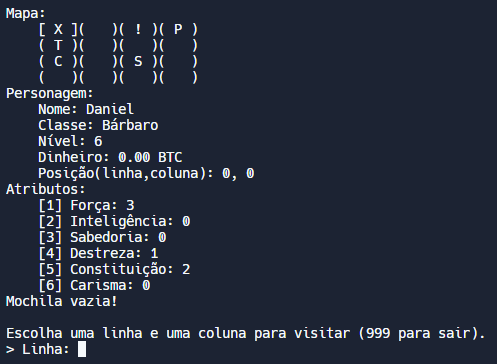

# RPG Simples em C usando TADs

Este projeto é um RPG simples desenvolvido em **C** utilizando **Tipos Abstratos de Dados (TADs)** para estruturar o jogo. O projeto foi feito em **29 de maio de 2022**, enquanto estudava os conceitos de programação em baixo nível. Através dos TADS, ele implementa funcionalidades como:

- Inventário de itens
- Eventos dinâmicos
- Mapa interativo
- Sistema de dinheiro
- Progressão de nível
- Atributos dos personagens

O jogo oferece uma experiência básica, com foco na organização e implementação de conceitos de programação. Os TADs para mantêm o código modular e fácil de expandir.

## Demonstração ao vivo

É possível conferir o meu projeto pelo navegador, através do Replit.com ([clique aqui](https://replit.com/@DANIELCAMPOS26/rpgemc?v=1#main.c))
